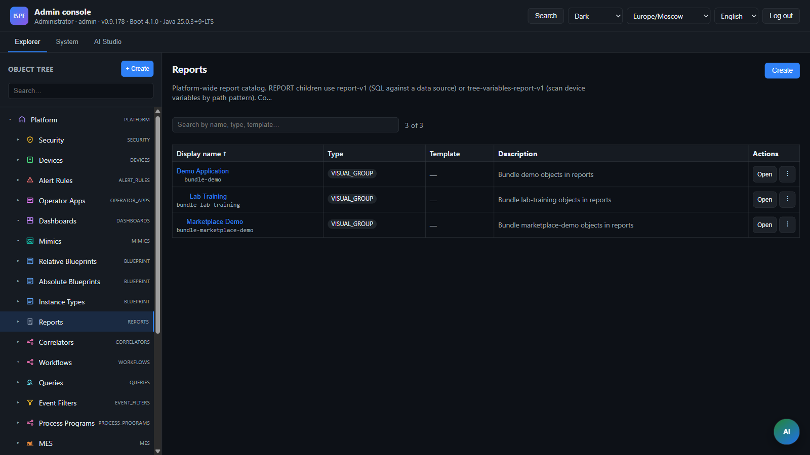

> **Язык:** русская версия (вычитка). Канонический английский: [en/reports.md](../en/reports.md).

# Отчёты приложений (REQ-PF-12)

> **Статус:** Stable — SQL-отчёты, CSV. Теги: [doc-status](../en/doc-status.md).

Generic-слой SQL-отчётов. **Сначала дерево (этапы 12–14):** определение объекта `REPORT` в `root.platform.reports.*` (blueprint `report-v1`); Схема SQL — через **`dataSourcePath`** → `root.platform.data-sources.*`.

Legacy API `/api/v1/applications/{appId}/reports/*` сохранён и делегирует в дерево. Импорт bundle: `POST /api/v1/platform/packages/import`.

## Дерево объектов



| Узел | Тип | Blueprint |
|------|-----|--------|
| `root.platform.reports` | `REPORTS` | — |
| `root.platform.reports.{reportId}` | `REPORT` | `report-v1` |

Переменные объекты:

| Переменная | Описание |
|----------|----------|
| `title` | Заголовок |
| `dataSourcePath` | Путь к `DATA_SOURCE` (`root.platform.data-sources.*`) — schema для SQL |
| `query` | SELECT / WITH |
| `parameters` | JSON array имён `?`-параметров |
| `columns` | JSON array `{field, label}` |
| `defaultParameters` | JSON object значений по умолчанию |
| `maxRows` | Лимит строк (default 1000) |
| `refreshIntervalMs` | Auto-refresh в UI (default 30000) |
| `templateFormat` | Формат YARG-шаблона: `xlsx`, `docx`, `html` (пусто = нет шаблона) |

Бинарный шаблон хранится в таблице `report_templates` (не в object_variables).

Веб-консоль: **Report Builder** — структурированный редактор (параметры/столбцы, без ручного JSON), предварительный просмотр SQL, CSV, вкладка **Шаблон YARG**, экспорт PDF/XLSX/HTML. Переключатель **sql** | **дерево-переменные**.

### tree-variables (blueprint `tree-variables-report-v1`)

| Переменная | Описание |
|----------|----------|
| `reportType` | `tree-variables` |
| `devicePathPattern` | Префикс или glob пути устройств (`*`, `?`) |
| `variableName` | Имя переменной на каждом объекте |
| `columns` | JSON array `{field, label}` (по умолчанию path, value) |

Сохранение: `PUT /api/v1/reports/by-path/tree-variables-definition?path=...`

## Экспорт матрицы (UI)

| поверхность | CSV | PDF/XLSX/HTML |
|-------------|-----|----------------|
| Построитель отчетов | да | да (если шаблон YARG) |
| Dashboard widget `report` | настраивается (`showCsv`, …) | настраивается + template |
| Operator manifest `screen.report` | да | да (если template) |
| Приложение оператора (ReportBuilder) | да | да (если шаблон) |

## Dashboard widget `type: "report"`

| Поле | Описание |
|------|----------|
| `reportPath` | Путь REPORT |
| `parametersJson` | Статические параметры run |
| `contextParamsJson` | `{reportParam: sessionParamKey}` |
| `showCsv` / `showPdf` / `showXlsx` / `showHtml` | Кнопки export |
| `showTruncatedWarning` | Banner при truncated rows |

## API на основе пути (основной)

```http
GET  /api/v1/reports/by-path?path=root.platform.reports.ready-items
PUT  /api/v1/reports/by-path/definition?path=...
PUT  /api/v1/reports/by-path/tree-variables-definition?path=...
POST /api/v1/reports/by-path/run?path=...
GET  /api/v1/reports/by-path/export?path=...&format=csv|pdf|xlsx|html
POST /api/v1/reports/by-path/template?path=...&format=xlsx   (multipart file)
GET  /api/v1/reports/by-path/template?path=...
DELETE /api/v1/reports/by-path/template?path=...
```

### Запуск (по пути)

```http
POST /api/v1/reports/by-path/run?path=root.platform.reports.ready-items
Content-Type: application/json

{ "parameters": { "status": "ready" } }
```

## Шаблоны отчётов (Band1)

Заполнение spreadsheet-шаблонов — **ISPF Template Filler** (Apache POI; [ADR-0053](decisions/0053-ispf-template-filler.md)). DOCX/HTML пока могут идти через YARG.

1. Excel-шаблон с именованным диапазоном **`Band1`** и полями `${Band1.COLUMN}` (колонки SQL в **верхнем регистре**).
2. Загрузка во вкладке **Шаблон отчёта** в Report Builder (`POST .../template`).
3. Экспорт: `GET .../export?format=pdf|xlsx|html`.

Конфиг: `ispf.reports.template-engine=poi` (по умолчанию) или `yarg`.

**Ограничение:** YARG + docx4j 8.3.x запинены для DOCX; не поднимать docx4j до 17+, пока DOCX на YARG.

Без шаблона доступны CSV и табличные HTML/XLSX.

## Развертывать

Через bundle (`reports[]` создаёт объект в `root.platform.reports.{reportId}`):

```json
{
  "reports": [
    {
      "reportId": "ready-items",
      "title": "Готовые позиции",
      "query": "SELECT item_code, status FROM demo_item WHERE status = ?",
      "parameters": ["status"],
      "columns": [
        { "field": "item_code", "label": "Код" },
        { "field": "status", "label": "Статус" }
      ],
      "maxRows": 500
    }
  ]
}
```

Устаревшее развертывание:

```http
POST /api/v1/applications/{appId}/reports/deploy
```

## API устаревшего приложения

```http
GET  /api/v1/applications/{appId}/reports
POST /api/v1/applications/{appId}/reports/{reportId}/run
GET  /api/v1/applications/{appId}/reports/{reportId}/export?format=csv|pdf|xlsx|html
```

## Пользовательский интерфейс оператора

- **operatorUi `reports[]`:** навигация по path отчётов (как `dashboards[]`).
- **Виджет дашборда `type: "report"`** — таблица по `reportPath` с `parametersJson`/сопоставление сеансов и панель инструментов экспорта.
- **Legacy manifest** `screen.report` — CSV + PDF/XLSX/HTML при YARG template.

## Права

| Конечная точка | Роль |
|----------|------|
| `GET .../reports/by-path`, export | `operator`, `admin` |
| `PUT .../definition`, template upload/delete | `admin` |
| `POST .../run` | `operator`, `admin` |
| `POST .../applications/.../deploy` (reports.md) | `admin` |

## Ограничения

- Только read-only SQL (без `INSERT`/`UPDATE`/`DELETE`/DDL).
- Запрос выполняется в schema объекта data source (`dataSourcePath`).
- PDF/XLSX/HTML со spreadsheet-шаблоном — Band1 (POI по умолчанию); DOCX требует Word-шаблон.

## Пример

[examples/demo-app/](../../examples/demo-app/) — `POST /api/v1/platform/packages/import?packageId=demo` или устаревшее развертывание на `demo`, отчёты в `root.platform.reports.*`.

## Связанные документы

- [applications](applications.md) — развертывание пакета
- [dashboards](dashboards.md) — аналогичная древовидная модель
- [roadmap](roadmap.md) — Этапы 12–13.
