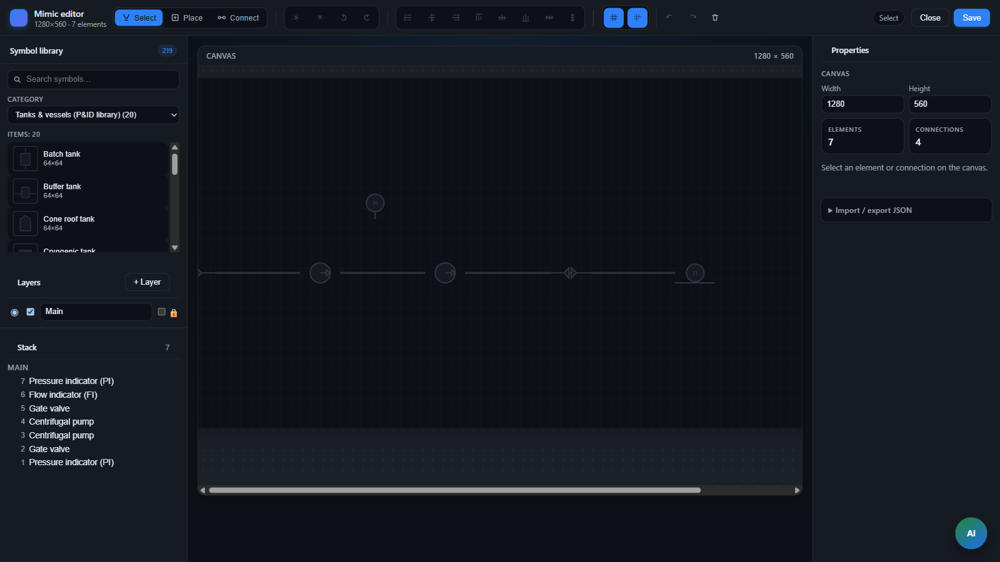

> **Язык:** русская версия (вычитка). Канонический английский: [en/scada-mimic.md](../en/scada-mimic.md).

# SCADA mimic — справочник diagramJson и API

> **Статус:** Stable — diagramJson, REST API. Хаб: [doc-status.md](doc-status.md).

Технический справочник по формату документа и REST API. Обзор возможностей, workflow и архитектуры: **[scada](scada.md)**.

---

## Концепции

| Концепция | Описание |
|---------|-------------|
| Виджет `scada-mimic` | Виджет дашборда, который рендерит документ мнемосхемы |
| Объект `MIMIC` | Переиспользуемая схема в `root.platform.mimics.*` (модель `mimic-v1`) |
| `diagramJson` | JSON-документ: elements, connections, bindings, customSymbols |
| `grid.snap` | Когда `true`, размещение и drag привязываются к `grid.size` (по умолчанию **выкл.**; toggle в тулбаре редактора) |
| `grid.visible` | Показать сетку редактора (по умолчанию **выкл.**; toggle в тулбаре) |
| Symbol registry | Pack SVG (`pack.ispf-pid.*`) + per-document `customSymbols` |

---

## Схема документа (v2)

Поддерживается только **версия 2**. Устаревшие документы версии 1 при загрузке нормализуются до версии 2 (пустая версия 1 → пустой документ по умолчанию).

```json
{
  "version": 2,
  "width": 1600,
  "height": 900,
  "background": "var(--bg)",
  "grid": { "size": 1, "snap": false, "visible": false },
  "layers": [{ "id": "layer-default", "name": "Main", "visible": true }],
  "elements": [{
    "id": "t1",
    "symbolId": "pack.ispf-pid.vertical-tank",
    "layerId": "layer-default",
    "x": 100,
    "y": 80,
    "rotation": 0,
    "bindings": {
      "fillLevel": {
        "objectPath": "root.platform.devices.demo-sensor-01",
        "variableName": "level",
        "valueField": "value",
        "transform": "number"
      }
    },
    "actions": [{
      "id": "act1",
      "type": "toggleVariable",
      "objectPath": "root.platform.devices.demo-valve-01",
      "variableName": "open",
      "valueField": "value"
    }]
  }],
  "connections": [{
    "id": "c1",
    "layerId": "layer-default",
    "from": { "elementId": "t1", "port": "e" },
    "to": { "elementId": "v1", "port": "n" },
    "points": [
      { "x": 180, "y": 140 },
      { "x": 249, "y": 140 },
      { "x": 249, "y": 120 },
      { "x": 318, "y": 120 }
    ],
    "bindings": {
      "flowing": {
        "objectPath": "root.platform.devices.demo-pump-01",
        "variableName": "running",
        "valueField": "value",
        "transform": "bool"
      }
    }
  }],
  "customSymbols": []
}
```

### Поля элемента

| Поле | Описание |
|-------|-------------|
| `symbolId` | Pack id (`pack.ispf-pid.vertical-tank`), `custom:{libraryId}` or `custom.svg` |
| `x`, `y` | Top-left position on artboard (px) |
| `rotation` | `0` \| `90` \| `180` \| `270` |
| `scale` | Optional multiplier; editor resize writes `props.width/height` and sets `scale` to `1` |
| `bindings` | Map binding key → `MimicBinding` |
| `actions` | Operator click handlers |
| `formatRules` | Conditional styling by binding value |
| `labels` | Text labels on symbol |
| `tooltip` | Hover text (recommended actions, alarm hints) |
| `props` | Symbol-specific props (see below) |

### Mimic actions (`actions[]`)

| `type` | Fields | Runtime behavior |
|--------|--------|------------------|
| `toggleVariable` | `objectPath`, `variableName`, optional `value` | Flip or set a boolean/command variable |
| `invokeFunction` | `objectPath`, `functionName`, optional `paramsJson` | Call object function |
| `navigate` | `dashboardPath`, опционально `selectionJson` | Откройте другую панель управления; дополнительный выбор сеанса семян `{"equipment":"..."}` |
| `setSelection` | `selectionKey` + `objectPath`, **или** `selectionJson` | Оставайтесь на текущем HMI; обновить выбор сессии дашборда (например, детализацию карты оборудования) |
| `pulse` (функция) | `sourceType: "pulse"`, `sourceBody: {"variable":"cmdStart"}` | Обработчик платформы записывает логическую командную переменную при вызове |
| `toggleLayer` | `layerId` | Show/hide mimic layer |
| `toggleExpand` | `elementId` | Expand/collapse symbol group |
| `cycleUnit` | `bindingKey`, `units[]` | Cycle displayed engineering unit |

**Встроенный HMI оператора (mini-TEC):** привязывайте щелчки GPU/GRPB к `setSelection` с `selectionKey: "equipment"`, чтобы правая панель карты обновлялась, не выходя из `mini-tec-hmi`. Используйте `navigate` только при открытии отдельной дашборда.

Example `setSelection`:

```json
{
  "id": "sel-gpu2",
  "type": "setSelection",
  "selectionKey": "equipment",
  "objectPath": "root.platform.devices.mini-tec-plant.gpu-02"
}
```

Or multiple slots via `selectionJson`:

```json
{
  "id": "sel-hub",
  "type": "setSelection",
  "selectionJson": "{\"equipment\":\"root.platform.devices.mini-tec-plant.station-hub\"}"
}
```

**PNG export:** operator mimic widget toolbar → «Export PNG» (`ScadaMimicWidgetView`).

**Common `props` keys (editor):**

| Ключ | Описание |
|-----|-------------|
| `width`, `height` | Явный размер символа в пикселях (переопределяет значение по умолчанию в реестре, если установлено) |
| `flipX`, `flipY` | Boolean mirror flags (toolbar Flip H/V) |
| `svg`, `viewBox`, … | Custom SVG inner markup (`custom.svg` / `custom:{id}`) |

Effective render size: `symbolSize()` in `registry.ts` — `(props.width \|\| defaultWidth) * (scale ?? 1)`.

### `customSymbols[]` (document library)

Определения SVG-символов, на которые ссылаются элементы с `symbolId: "custom:{id}"`. Поля:

| Поле | Описание |
|-------|-------------|
| `id` | Уникальный id в документе (элемент: `custom:{id}`) |
| `name` | Подпись в редакторе |
| `svg` | Inner SVG markup (без корневого `<svg>`) |
| `width`, `height`, `viewBox` | Геометрия и viewport |
| `ports` | Точки Connect |
| `bindingSchema` | Слоты привязок для панели свойств |
| `behaviors` | Динамика SVG на HMI (см. [SCADA.md § Custom SVG](scada.md)) |
| `sourceSymbolId` | Опционально: исходный pack/legacy id |
| `inUserLibrary` | `true` — символ виден в палитре «Свои SVG» |

Bootstrap-записи без `inUserLibrary` используются только для отрисовки (мини-ТЕК, конвейер).

### Маршрутизация подключения

Сохраненные `points` обновляются при перемещении конечных точек. Отображение в runtime и перенаправление всегда пересчитывают **ортогональный** путь из позиций портов (`routeOrthogonal` в `connectionRouting.ts`).

---

## Точки входа в редактор



- **Dashboard Builder:** widget `scada-mimic` → «Open mimic editor»
- **Explorer:** `root.platform.mimics` → create mimic → open `MIMIC` object

### Инструменты (панель инструментов + клавиатура)

| Инструмент | Ключи | Заметки |
|------|------|-------|
| Выбрать | `V` | Щелкните, Shift+множественный выбор, перетащите маркеры, измените их размер (одиночный выбор) |
| Place | `P` | Palette → canvas click |
| Connect | `C` | Port-to-port orthogonal line |
| Flip H / V | toolbar | Toggles `props.flipX` / `props.flipY` |
| Rotate ±90° | toolbar | Cycles `rotation` |
| Выровнять L/C/R/T/M/B | панель инструментов | Требуется ≥ 2 выбранных элемента |
| Распределить H/V | панель инструментов | Требуется ≥ 3 выбранных элемента |
| Grid visible / snap | toolbar | Toggles `grid.visible` / `grid.snap` |
| Undo / Redo | `Ctrl+Z` / `Ctrl+Y` | Document history |
| Delete | `Del`, `Backspace` | Selected elements or connection |
| Import / Export JSON | panel | Raw `diagramJson` edit |

Интеллектуальная привязка во время перетаскивания: края/центры/порты элемента выравниваются по другим элементам в пределах ~10 пикселей (`elementSnap.ts`). Групповое перетаскивание перемещает все выбранные элементы вместе.

Implementation: `ScadaMimicEditor.tsx`, `ScadaMimicCanvas.tsx`, `layoutOps.ts`, `elementSnap.ts`.

Обзор (RU): [SCADA.md § Редактор](scada.md).

---

## ОТДЫХ API

| Метод | Путь | Цель |
|--------|------|---------|
| GET | `/api/v1/mimics/by-path?path=` | Load mimic |
| PUT | `/api/v1/mimics/by-path/diagram?path=` | Save `diagramJson` |
| PUT | `/api/v1/mimics/by-path/title?path=` | Save title |

---

## Демо-версии Bootstrap

| Демо | Mimic | Dashboard | appId |
|------|-------|-----------|-------|
| Tank farm | `root.platform.mimics.tank-farm-demo` | `root.platform.dashboards.tank-farm-hmi` | `tank-farm-demo` |
| Pipeline SCADA (РП) | `root.platform.mimics.pipeline-rp` | `root.platform.dashboards.pipeline-scada-hmi` | `pipeline-scada` |
| Mini-TEC SLD | `root.platform.mimics.mini-tec-single-line` | `root.platform.dashboards.mini-tec-hmi` (default operator) | `mini-tec` |
| Mini-TEC zones | `mini-tec-zone-gas`, `mini-tec-zone-electrical` | tabs on `mini-tec-hmi` | `mini-tec` |

Приборы (резервуарный парк): `root.platform.devices.tank-farm-demo.tank-11` … `tank-24`, `manifold-hub`.
Профили виртуальных драйверов: `tank-farm-tank`, `tank-farm-hub`.

Повторно экспортируйте серверный JSON после редактирования шаблонов TypeScript:

```bash
cd apps/web-console && npx tsx -e "import { MINI_TEC_SLD_DOCUMENT_JSON } from './src/scada/templates/miniTecSld.ts'; import fs from 'fs'; fs.writeFileSync('../../packages/ispf-server/src/main/resources/bootstrap/mini-tec-mimic.json', MINI_TEC_SLD_DOCUMENT_JSON)"
```

```bash
cd apps/web-console && npx tsx src/scada/templates/exportTankFarmMimic.ts
```

```bash
cd apps/web-console && npx tsx src/scada/templates/pipeline-scada/exportPipelineScadaMimics.ts
```

---

## Каталог символов

Палитра редактора — **только SVG**:

| Category | `symbolId` prefix | Notes |
|----------|-------------------|--------|
| `pack-valves`, `pack-pumps`, `pack-tanks`, `pack-pipes`, `pack-sensors`, `pack-electrical`, `pack-isa`, `pack-misc` | `pack.ispf-pid.` | Стандартный пакет P&ID (~57); см. `tools/symbol-pack-isa` |
| `common` | `custom.svg` | Inline SVG in element props |
| Custom (palette) | `custom:` | Only defs with `inUserLibrary: true` |

Динамические символы (метки, блоки графического процессора, выключатели в активном состоянии): определите в `customSymbols[]` с помощью `behaviors` + `bindingSchema`. Ссылка: `mini-tec-mimic.json`.

Полное руководство: [SCADA.md § Каталог символов](scada.md), [scada-symbol-library](scada-symbol-library.md).
