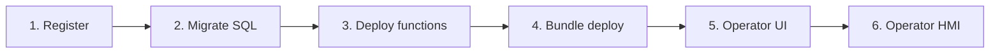

> **Язык:** русская версия (вычитка). Канонический английский: [en/solution-developer-guide.md](../en/solution-developer-guide.md).

# Руководство разработчика решений

Как создать прикладное решение на ISPF **без изменений ядра Java**: приложения для регистрации, SQL-данные, JSON-функции, пакетное развертывание, пользовательский интерфейс оператора и отчёты.

Обзор продукта: [product](product.md). Полный API: [applications](applications.md). **Стабильная граница платформы ↔ решение:** [solution-developer-public-api](solution-developer-public-api.md).

---

## Основной принцип

**Бизнес-логика живёт на платформе** — в моделях, переменных, событиях, функциях и рабочих процессах **дерева объектов**. Ваше решение не включает Java на сервер: оно выполняет механизмы декларативной-конфигурации ISPF (модели, BPMN, скрипт-функции, объекты, правила оповещений). Bundle Deploy — способ **доставить** эту конфигурацию в платформу. Полный привод P1–P10 (для людей и агентов): [application-principles](application-principles.md). См. также [architecture](architecture.md).

## Что такое «решение» на ISPF

**Решение (приложение)** — зарегистрированное приложение с изолированной SQL-схемой, скрипт-функциями, бандлом (объекты, дашборды, BPMN, модели) и пользовательским интерфейсом оператора. Логика решения **исполняется** на узлах дерева объектов и через среду выполнения платформы; запись `applications` — реестр и схема приложения, не параллельный движок.

| Идея | Где живёт | Пример |
|-----------|-----------|--------|
| **Бизнес-логика** | Конфигурация дерева объектов | модель, переменная + CEL, `WORKFLOW`, `ALERT`, скрипт-функция |
| **Platform object** | Дерево объектов | `root.platform.devices.pump-01` |
| **Application** | Реестр + schema `app_myapp` | `my-terminal` |
| **Operator app** | `operator_app_ui` + дерево `operator-apps` | `platform`, `oil-terminal` |

**Сходимость по дереву (этап 5.5):** после `POST .../deploy` функция адресуется как `{appId}.functions.{name}` на пути к объекту; Привязки SQL могут существовать как `bindingExpression: sqlBinding('appId','var')` переменные; `objects[]` в комплекте обновляет периодические узлы (согласовывает), а не только создаёт новые.

> **Не эквивалентно считать уровень приложения как среда выполнения.** Запись `applications` — реестр и изолированная SQL-схема; Вызов, рабочий процесс, оповещения и дашборды работают через **API дерева объектов**. Если бандл ещё возникает только `/applications/{appId}/functions/invoke` без древовидных путей — мигрируйте на Tree-First (см. [APPLICATIONS.md § Deprecation path](applications.md)).

### Миграция устаревшего пакета по дереву

| Было (наследие) | Стало (Target approach) |
|---------------|-------------------|
| Только `POST .../functions/invoke` по appId | `POST /bff/invoke` или `objects/by-path/functions/invoke` по `{appId}.functions.*` |
| `screens[]` в operator manifest | `operatorUi` + dashboards в `dashboards[]` / дереве |
| Новые `objects[]` только создать | Согласование: повторное развертывание обновляет переменные узлы |
| Imperative sync Java → variables | CEL bindings, `sqlBinding()`, script steps |

---

## Жизненный цикл решения



### Шаг 1. Регистрация

```http
POST /api/v1/applications
Authorization: Bearer <admin-token>
Content-Type: application/json

{
  "appId": "my-terminal",
  "displayName": "Oil Terminal",
  "tablePrefix": "ot_",
  "schemaName": "oil_terminal"
}
```

Или через admin console: выберите `root.platform.applications` → **+ Deploy-приложение**.

### Шаг 2. SQL-миграция

Приложение SQL **не** открывается на платформе Flyway. Миграции деплоятся по изолированной схеме:

```http
POST /api/v1/applications/my-terminal/data/migrate
Content-Type: application/json

{
  "version": "1.0.0",
  "scripts": [
    {
      "id": "orders",
      "sql": "CREATE TABLE IF NOT EXISTS ot_order (id SERIAL PRIMARY KEY, status VARCHAR(32), created_at TIMESTAMPTZ DEFAULT NOW());"
    }
  ]
}
```

Повторный вызов с тем же `version` + `id` — идемпотентен.

Проверка результата:

```http
GET /api/v1/applications/my-terminal/data/status
```

### Шаг 3. JSON-функции

Функции — JSON **script** с шагами (`selectOne`, `selectMany`, `exec`, `return`).
Поля шага — **`sql`** + **`var`** (не `query` / `into`); скрипт обязан заканчиваться на `return.fields`:

```http
POST /api/v1/applications/my-terminal/functions/deploy
Content-Type: application/json

{
  "functions": [
    {
      "name": "listOrders",
      "description": "Active orders",
      "script": {
        "steps": [
          {
            "type": "selectMany",
            "var": "rows",
            "sql": "SELECT id, status FROM ot_order WHERE status = 'ACTIVE' ORDER BY created_at"
          },
          {
            "type": "return",
            "fields": {
              "rows": "${rows}"
            }
          }
        ]
      }
    }
  ]
}
```

Вызов из BPMN (service task `INVOKE_FUNCTION`) или через BFF. Для таблицы SQL-строк на дашборде используйте виджет **report** (`configure_report` + `type: report`), а не `object-table` (тот виджет — только для дочерних объектов дерева).

### Шаг 4. Bundle deploy (канон: JSON)

**Канонический API:** `POST /api/v1/applications/{appId}/deploy` с телом **JSON** (`Content-Type: application/json`). Multipart ZIP на текущем сервере нет. Полный справочник полей: [applications](applications.md).

Минимальный пример:

```http
POST /api/v1/applications/my-terminal/deploy
Authorization: Bearer <admin-token>
Content-Type: application/json

{
  "version": "1.0.0",
  "displayName": "Oil Terminal",
  "tablePrefix": "ot_",
  "schemaName": "oil_terminal",
  "objects": [],
  "dashboards": [
    {
      "path": "root.platform.dashboards.terminal-overview",
      "title": "Overview",
      "layoutJson": "{ \"columns\": 84, \"rowHeight\": 8, \"widgets\": [] }"
    }
  ],
  "migrations": [],
  "functions": [],
  "operatorUi": {
    "title": "Oil Terminal",
    "dashboards": [
      { "dashboardPath": "root.platform.dashboards.terminal-overview", "label": "Overview" }
    ],
    "defaultDashboardPath": "root.platform.dashboards.terminal-overview"
  },
  "reports": [
    {
      "name": "daily-summary",
      "sql": "SELECT status, COUNT(*) FROM ot_order GROUP BY status"
    }
  ]
}
```

Layout дашбордов — сетка **84×8** ([dashboards](dashboards.md)), не legacy `columns: 12` / `rowHeight: 72`.

### Шаг 5. Интерфейс оператора

Пользовательский интерфейс оператора определяет, какие дашборды видит оператор и как они организованы.

**Способ А — через API операторских приложений (рекомендуется):**

```http
PUT /api/v1/operator-apps/my-terminal/ui
Content-Type: application/json

{
  "title": "Oil Terminal",
  "dashboards": [
    {
      "dashboardPath": "root.platform.dashboards.terminal-overview",
      "label": "Overview"
    },
    {
      "dashboardPath": "root.platform.dashboards.terminal-queue",
      "label": "Queue"
    }
  ],
  "defaultDashboardPath": "root.platform.dashboards.terminal-overview"
}
```

**Способ Б — через консоль администратора:**

1. `root.platform.operator-apps` → **+ Приложение «Оператор»**
2. Открыть созданный узел → панель Панель приложений оператора.
3. Настройте заголовок, список дашбордов, панель управления по умолчанию.

**Способ C — в bundle** (`operatorUi` в manifest) — подхватывается при deploy.

### Шаг 6. Проверка

```
http://localhost:5173?mode=operator&app=my-terminal
```

---

## Дашборды для решений

Дашборды — **объекты платформы** типа `DASHBOARD`. Создайте их в admin console:

1. `root.platform.dashboards` → **+ Объект**
2. Дважды кликните → Конструктор дашбордов
3. Добавьте виджеты, привяжите к объектам (`objectPath`) или таблицам (`selectionKey`)
4. Укажите путь дашборда в интерфейсе оператора.

Виджеты для прикладных экранов:

| Виджет | Применение |
|--------|------------|
| `object-table` | Список заказов/устройств с выбором строки |
| `function-button` | Вызов platform function или app function |
| `dashboard-link` | Навигация между экранами |
| `card-grid` | Карточки с KPI |

Подробнее: [dashboards](dashboards.md).

---

## BFF (бэкенд для внешнего интерфейса)

Для сложных экранов используйте BFF. **Каноническое тело** (tree-first):

```http
POST /api/v1/bff/invoke
Authorization: Bearer <token>
Content-Type: application/json

{
  "objectPath": "root.platform.applications.my-terminal.functions",
  "functionName": "listOrders",
  "input": {
    "schema": { "name": "in", "fields": [] },
    "rows": [{}]
  },
  "wireProfile": "ispf-operator-v1"
}
```

После deploy функции доступны на дереве как `{appId}.functions.{name}`. Подробнее: [applications](applications.md). Предпочитайте **дашборды + function-button / function-form**.

---

## SQL-отчёты

```http
GET /api/v1/applications/my-terminal/reports/daily-summary?format=csv
```

Отчёт описан в bundle (`reports[]`) или деплоится отдельно. Экспорт — CSV.

Подробнее: [reports](reports.md).

---

## Расписания

Функции периодического вызова:

```http
POST /api/v1/schedules
Content-Type: application/json

{
  "name": "nightly-cleanup",
  "cron": "0 0 2 * * *",
  "appId": "my-terminal",
  "function": "archiveOrders",
  "enabled": true
}
```

---

## Интеграция с BPMN

Service task с `ispf:actionType="INVOKE_FUNCTION"`:

```xml
<bpmn:serviceTask id="Task_ListOrders" name="List orders"
  ispf:actionType="INVOKE_FUNCTION"
  ispf:functionAppId="my-terminal"
  ispf:functionName="listOrders"
  ispf:resultVariable="orders"/>
```

Задача пользователя → Задача в Work Queue для оператора.

Подробнее: [workflows](workflows.md).

---

## Структура структуры

```
examples/demo-app/
├── manifest.yaml
├── functions/
│   └── demo_listItems.script.json
└── sql/
    └── V1__demo.sql
```

Запуск демо: зарегистрируйте приложение, выполните миграцию + развертывание функций в [applications](applications.md).

---

## Ограничения и лучшие практики

| Правило | Почему |
|---------|--------|
| SQL только в приложениях схемы | Изоляция от столов-платформ |
| Префикс таблиц (`tablePrefix`) | Guard от коллизий |
| Не менять Java `ispf-server` | Отраслевой код — в bundle |
| Дашборды — объекты-платформы | Единый HMI для администратора и оператора |
| Operator UI на сервере | Не хранить конфиг в `public/` |
| функции — идемпотентные задержки | Безопасный передислокация |

---

## Чеклист перед производством

- [ ] Приложение зарегистрировано, схема создана
- [ ] Миграции применены (`GET .../data/status`)
- [ ] Функции задеплоены и протестированы через BFF
- [ ] Дашборды созданы и установлены в пользовательском интерфейсе оператора.
- [ ] Operator app доступен по `?mode=operator&app=<id>`
- [ ] RBAC: операторы имеют роль `operator`, не `admin`
- [ ] Keycloak настроен (профиль `dev`/prod)

---

## Связанные документы

- [applications](applications.md) — полный REQ-PF API
- [reports](reports.md) — отчеты SQL
- [dashboards](dashboards.md) — виджеты
- [web-console](web-console.md) — интерфейс администратора для настройки
- [glossary](glossary.md) — термины
- [roadmap](roadmap.md) — статус REQ-PF
