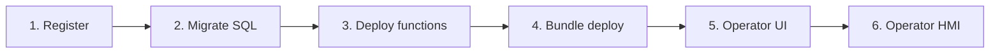

> **Язык:** русская версия (вычитка). Канонический английский: [en/solution-developer-guide.md](../en/solution-developer-guide.md).

# Руководство разработчика решений

> **Статус:** Stable — Deploy, operator UI, bundles. Теги: [doc-status](doc-status.md).

Как собрать прикладное решение на ISPF **без изменений ядра Java**: регистрация приложения, SQL-данные, JSON-функции, bundle deploy, operator UI и отчёты.

Обзор продукта: [product](product.md). Полный API: [applications](applications.md). **Стабильная граница platform ↔ solution:** [solution-developer-public-api](solution-developer-public-api.md).

---

## Основной принцип


**Бизнес-логика живёт на платформе** — в моделях, переменных, событиях, функциях и workflows на **дереве объектов**. Ваше решение не добавляет Java на сервер: оно конфигурирует механизмы ISPF декларативно (blueprints, BPMN, script functions, objects, alert rules). Bundle deploy — способ **доставить** эту конфигурацию на платформу. Полные принципы P1–P10 (для людей и агентов): [application-principles](application-principles.md). См. также [architecture](architecture.md).

## Что такое «решение» на ISPF

**Решение (application)** — зарегистрированное приложение с изолированной SQL-схемой, script-функциями, bundle (objects, dashboards, BPMN, blueprints) и operator UI. Логика решения **исполняется** на узлах дерева объектов и через platform runtime; запись `applications` — реестр и app schema, не параллельный движок.

| Понятие | Где живёт | Пример |
|---------|-----------|--------|
| **Бизнес-логика** | Механизмы дерева объектов | blueprint, variable + CEL, `WORKFLOW`, `ALERT`, script function |
| **Platform object** | Дерево объектов | `root.platform.devices.pump-01` |
| **Application** | Реестр + schema `app_myapp` | `my-terminal` |
| **Operator app** | `operator_app_ui` + дерево `operator-apps` | `platform`, `oil-terminal` |

**Tree-first convergence (Phase 5.5):** после `POST .../deploy` функции адресуются как `{appId}.functions.{name}` на object path; SQL bindings могут жить как `bindingExpression: sqlBinding('appId','var')` на переменной; `objects[]` в bundle обновляет существующие узлы (reconcile), а не только создаёт новые.

> **Не используйте application layer как runtime.** Запись `applications` — реестр и изолированная SQL-схема; invoke, workflow, alerts и dashboards идут через **object tree API**. Если bundle всё ещё вызывает только `/applications/{appId}/functions/invoke` без tree paths — мигрируйте на tree-first (см. [applications](applications.md)).

### Миграция legacy bundle на tree-first

| Было (legacy) | Стало (target approach) |
|---------------|-------------------------|
| Только `POST .../functions/invoke` по appId | `POST /bff/invoke` или `objects/by-path/functions/invoke` на `{appId}.functions.*` |
| `screens[]` в operator manifest | `operatorUi` + dashboards в `dashboards[]` / дереве |
| `objects[]` только создаёт новые узлы | Reconcile: redeploy обновляет существующие узлы |
| Imperative Java sync → variables | CEL bindings, `sqlBinding()`, script steps |

---

## Жизненный цикл решения



### Шаг 1. Регистрация

```http
POST /api/v1/applications
Authorization: Bearer <admin-token>
Content-Type: application/json

{
  "appId": "my-terminal",
  "displayName": "Oil Terminal",
  "tablePrefix": "ot_",
  "schemaName": "oil_terminal"
}
```

Или через admin console: выберите `root.platform.applications` → **+ Deploy application**.

### Шаг 2. SQL-миграция

SQL приложения **не** управляется platform Flyway. Миграции деплоятся в изолированную схему:

```http
POST /api/v1/applications/my-terminal/data/migrate
Content-Type: application/json

{
  "version": "1.0.0",
  "scripts": [
    {
      "id": "orders",
      "sql": "CREATE TABLE IF NOT EXISTS ot_order (id SERIAL PRIMARY KEY, status VARCHAR(32), created_at TIMESTAMPTZ DEFAULT NOW());"
    }
  ]
}
```

Повторный вызов с тем же `version` + `id` идемпотентен.

Проверка результата:

```http
GET /api/v1/applications/my-terminal/data/status
```

### Шаг 3. JSON-функции

Функции — JSON **scripts** с шагами (`selectOne`, `selectMany`, `exec`, `return`).
Имена полей — **`sql`** + **`var`** (не `query` / `into`); каждый скрипт должен заканчиваться `return.fields`:

```http
POST /api/v1/applications/my-terminal/functions/deploy
Content-Type: application/json

{
  "functions": [
    {
      "name": "listOrders",
      "description": "Active orders",
      "script": {
        "steps": [
          {
            "type": "selectMany",
            "var": "rows",
            "sql": "SELECT id, status FROM ot_order WHERE status = 'ACTIVE' ORDER BY created_at"
          },
          {
            "type": "return",
            "fields": {
              "rows": "${rows}"
            }
          }
        ]
      }
    }
  ]
}
```

Вызов из BPMN (service task `INVOKE_FUNCTION`) или через BFF. Для списка SQL-строк на дашборде используйте виджет **report** (`configure_report` + `type: report`), а не `object-table` (только дочерние узлы дерева).

### Шаг 4. Bundle deploy (канон: JSON)

**Канонический API:** `POST /api/v1/applications/{appId}/deploy` с телом **JSON** (`Content-Type: application/json`). Multipart ZIP deploy на текущем сервере нет. Полный справочник полей: [applications](applications.md#bundle-deploy-req-pf-03).

Минимальный пример:

```http
POST /api/v1/applications/my-terminal/deploy
Authorization: Bearer <admin-token>
Content-Type: application/json

{
  "version": "1.0.0",
  "displayName": "Oil Terminal",
  "tablePrefix": "ot_",
  "schemaName": "oil_terminal",
  "objects": [],
  "dashboards": [
    {
      "path": "root.platform.dashboards.terminal-overview",
      "title": "Overview",
      "layoutJson": "{ \"columns\": 84, \"rowHeight\": 8, \"widgets\": [] }"
    }
  ],
  "migrations": [],
  "functions": [],
  "operatorUi": {
    "title": "Oil Terminal",
    "dashboards": [
      { "dashboardPath": "root.platform.dashboards.terminal-overview", "label": "Overview" }
    ],
    "defaultDashboardPath": "root.platform.dashboards.terminal-overview"
  },
  "reports": [
    {
      "name": "daily-summary",
      "sql": "SELECT status, COUNT(*) FROM ot_order GROUP BY status"
    }
  ]
}
```

Layout дашбордов — сетка **84×8** ([dashboards](dashboards.md)), никогда не legacy `columns: 12` / `rowHeight: 72`.

### Шаг 5. Интерфейс оператора

Operator UI определяет, какие дашборды видит оператор и как они организованы.

**Способ A — API operator apps (рекомендуется):**

```http
PUT /api/v1/operator-apps/my-terminal/ui
Content-Type: application/json

{
  "title": "Oil Terminal",
  "dashboards": [
    {
      "dashboardPath": "root.platform.dashboards.terminal-overview",
      "label": "Overview"
    },
    {
      "dashboardPath": "root.platform.dashboards.terminal-queue",
      "label": "Queue"
    }
  ],
  "defaultDashboardPath": "root.platform.dashboards.terminal-overview"
}
```

**Способ B — admin console:**

1. `root.platform.operator-apps` → **+ Operator app**
2. Откройте созданный узел → панель Operator Apps.
3. Настройте title, список дашбордов, default dashboard.

**Способ C — в bundle** (`operatorUi` в манифесте) — применяется при deploy.

### Шаг 6. Проверка

All-in-one JAR:

```
http://localhost:8080?mode=operator&app=my-terminal
```

Vite dev:

```
http://localhost:5173?mode=operator&app=my-terminal
```

---

## Дашборды для решений

Дашборды — **объекты платформы** типа `DASHBOARD`. Создайте их в admin console:

1. `root.platform.dashboards` → **+ Object**
2. Двойной клик → Dashboard Builder
3. Добавьте виджеты, привяжите к объектам (`objectPath`) или таблицам (`selectionKey`)
4. Укажите path дашборда в operator UI.

Виджеты для прикладных экранов:

| Виджет | Применение |
|--------|-----------|
| `object-table` | Список заказов/устройств с выбором строки |
| `function-button` | Вызов platform или app function |
| `dashboard-link` | Навигация между экранами |
| `card-grid` | KPI-карточки |

См. [dashboards](dashboards.md).

---

## BFF (backend for frontend)

Для сложных экранов (пагинация, формы) используйте BFF. **Каноническое тело** (tree-first):

```http
POST /api/v1/bff/invoke
Authorization: Bearer <token>
Content-Type: application/json

{
  "objectPath": "root.platform.applications.my-terminal.functions",
  "functionName": "listOrders",
  "input": {
    "schema": { "name": "in", "fields": [] },
    "rows": [{}]
  },
  "wireProfile": "ispf-operator-v1"
}
```

После deploy функции также адресуются на дереве как `{appId}.functions.{name}`. Детали и wire rules: [applications](applications.md#bff-req-pf-06). Предпочитайте **dashboards + function-button / function-form** вместо custom operator manifest shell.

---

## SQL-отчёты

```http
GET /api/v1/applications/my-terminal/reports/daily-summary?format=csv
```

Отчёт задаётся в bundle (`reports[]`) или деплоится отдельно. Экспорт — CSV.

См. [reports](reports.md).

---

## Расписания

Периодический вызов функций:

```http
POST /api/v1/schedules
Content-Type: application/json

{
  "name": "nightly-cleanup",
  "cron": "0 0 2 * * *",
  "appId": "my-terminal",
  "function": "archiveOrders",
  "enabled": true
}
```

---

## Интеграция с BPMN

Service task с `ispf:actionType="INVOKE_FUNCTION"`:

```xml
<bpmn:serviceTask id="Task_ListOrders" name="List orders"
  ispf:actionType="INVOKE_FUNCTION"
  ispf:functionAppId="my-terminal"
  ispf:functionName="listOrders"
  ispf:resultVariable="orders"/>
```

User task → задача Work Queue для оператора.

См. [workflows](workflows.md).

---

## Пример структуры

```
examples/demo-app/
├── bundle.json                 # or fragment files composed into POST …/deploy JSON
├── functions/
│   └── demo_listItems.script.json
└── sql/
    └── V1__demo.sql
```

Запуск демо: зарегистрируйте app, затем `POST …/deploy` JSON (или пошагово migrate + function deploy) по [applications](applications.md).

---

## Ограничения и практики

| Правило | Почему |
|---------|--------|
| SQL только в app schema | Изоляция от таблиц платформы |
| Префикс таблиц (`tablePrefix`) | Защита от коллизий |
| Не менять Java `ispf-server` | Отраслевой код живёт в bundle |
| Дашборды — объекты платформы | Единый HMI для admin и operator |
| Operator UI на сервере | Не хранить конфиг в `public/` |
| Функции — идемпотентный deploy | Безопасный redeploy |

---

## Чеклист перед production

- [ ] Приложение зарегистрировано, схема создана
- [ ] Миграции применены (`GET .../data/status`)
- [ ] Функции задеплоены и проверены через BFF
- [ ] Дашборды созданы и указаны в operator UI
- [ ] Operator app доступен по `?mode=operator&app=<id>`
- [ ] RBAC: у операторов роль `operator`, не `admin`
- [ ] Keycloak настроен (профиль `dev`/prod)

---

## Связанные документы

- [applications](applications.md) — полный REQ-PF API
- [reports](reports.md) — SQL-отчёты
- [dashboards](dashboards.md) — виджеты
- [web-console](web-console.md) — admin UI для настройки
- [glossary](glossary.md) — термины
- [roadmap](roadmap.md) — статус REQ-PF
